## Page 1

**Text:**

AMZ Consulting Pty Ltd
POWER BI 
CRASH COURSE

Exercise Files
& Quiz
Included
Concise, Practical, Jargon-Free guide
for Excel users to develop their first
Power BI Report
Just Power BI
Author: Ali Noorani  
2022 Edition

**Image 1:**

---

## Page 2

**Text:**

Power BI Crash Course 
 
Copyright © 2022 by AMZ Consulting Pty Ltd   
Published by: AMZ Consulting Pty Ltd    
Author: Ali Noorani 
 
  
 
Brisbane | Melbourne | Sydney | Adelaide | Perth | Canberra   
Australia   
Phone:  0410171609 
Web: https://www.powerbitraining.com.au/ 
Email:  info@amzconsulting.com.au 
  
Trademark Acknowledgments   
All terms mentioned in this manual that are known to be trademarks or service marks have 
been appropriately acknowledged or capitalized. Use of a term in this manual should not be regarded 
as affecting the validity of any trademark or service mark.    
Screen Shots © 1983-2021 Microsoft. All rights reserved.   
 
Disclaimer   
Every effort has been made to provide accurate and complete information. However, AMZ 
Consulting Pty Ltd assumes no responsibility for any direct, indirect, incidental, or consequential 
damages arising from the use of information in this document. Data and case study examples are 
intended to be fictional. Any resemblance to real persons or companies is coincidental.   
 
Copyright Notice   
This publication is protected in accordance with the provisions of the Copyright Act. Apart 
from permissions expressed in the Copyright Act pertaining to copying for study, review, or research, 
no part of this publication may be reproduced in any form, or stored in a database or retrieval system, 
or transmitted or distributed in any form by any means, electronic, mechanical photocopying, 
recording, or otherwise without written permission from AMZ Consulting Pty Ltd.

**Image 1:**

---

## Page 3

**Text:**

Power BI Beginner Crash Course: 
Getting Started with Power BI 
https://www.powerbitraining.com.au/

**Image 1:**

**Image 2:**

---

## Page 4

**Text:**

Chapter 1: Introduction to Power BI 
▪ What is Power BI 
▪ Different Products of Power BI 
▪ Competitive Advantages of Power BI 
CHAPTER 2                                                           | 3 minutes 
Chapter 2: Getting Started with Power BI 
▪ Setting Up Office365 Business Basic Trial Account 
▪ Power BI Service License Comparison 
▪ Downloading Power BI Desktop 
CHAPTER 3                                                          | 8 minutes 
 
Chapter 3: Power BI Desktop Navigation 
▪ Exploring Power BI Desktop Navigation 
▪ Getting Familiar with Ribbon Menu 
▪ Introduction to Visualizations and Fields Pane 
▪ Getting started with Power Query Editor 
CHAPTER 4                                                            | 2 minutes 
Chapter 4: Getting Data from Data Sources 
▪ 
Getting Data in Power BI 
▪ 
Getting Data from Excel 
Contents 
CHAPTER 1                                                          | 5 minutes 
CHAPTER 5                                                        | 15 minutes 
Chapter 5: Data Transformation 
▪ Removing Blank Rows from the Top 
▪ Removing Blank Columns and Choosing Relevant 
Columns 
▪ Renaming Column Names 
▪ Understanding the Data Types 
▪ Removing Errors 
▪ Removing Duplicates 
CHAPTER 6                                                           | 5 minutes 
Chapter 6: Introduction to Data Modeling 
▪ Understanding Data Modeling

---

## Page 5

**Text:**

▪ 
Contents 
CHAPTER 7                                                         | 5 minutes 
Chapter 7: Introduction to DAX 
▪ What is DAX? 
▪ 
CHAPTER 8                                                         | 10 minutes 
Chapter 8: Data Visualization 
▪ Data Visualization in Power BI 
▪ Creating a Card Visual 
▪ Creating an Area Chart 
▪ Creating a Bubble Map Visual 
▪ Creating a Donut Chart 
▪ Creating a Stacked Bar Chart 
▪ Creating a Slicer 
▪ Cardinality and Cross Filter Direction 
▪ Deleting Relationships 
▪ Creating New Relationships: Drag and Drop 
CHAPTER 9                                                         | 10 minutes 
Chapter 9: Publish and Share 
▪ Save and Publish to My Workspace 
▪ Sharing the Report

---

## Page 6

**Text:**

CHAPTER 1: INTRODUCTION TO POWER BI 
1 | P a g e                                                      
 
 
 
 
Introduction to Power BI 
 
 
 
 
 
 
 
 
 
 
 
 
 
 
 
 
 
 
 
 
 
 
 
Chapter 1 
✓ What is Power BI 
✓ Different Products of Power BI 
➢ Power BI Desktop 
➢ Power BI Service 
➢ Power BI Report Server 
➢ Power BI Mobile 
✓ Competitive Advantages of Power BI

**Image 1:**

---

## Page 7

**Text:**

CHAPTER 1: INTRODUCTION TO POWER BI 
2 | P a g e                                                      
 
What is Power BI 
Power BI is a suite of self-service BI tools to analyze data and share insights. Power BI 
has four different products i.e., Power BI Desktop, Power BI Service, Power BI Report Server 
and Power BI Mobile app and every product has its own capabilities and limitations. All stages 
of developing a BI solution can be seen in the flowchart below and these will be discussed 
throughout the course. 
 
 
• Getting Raw Data from 
SASS, Databases, Files, 
etc. 
Getting Raw 
Data
• Transforming Data in 
Query Editor using 
Query Formula 
Language 
Data 
Transformation
• Creating Data Model in 
Relationship View. 
Data 
Modeling
• Creating Visualizations 
in Report View.
Data 
Visualization
• Publishing and Sharing 
reports in Power BI 
Service.
Collaboration

**Image 1:**

---

## Page 8

**Text:**

CHAPTER 1: INTRODUCTION TO POWER BI 
3 | P a g e                                                      
 
Different Products of Power BI 
Power BI Desktop: 
Power BI Desktop is a free application that can be installed on a local computer. It lets 
you get data from multiple sources, transform raw data into clean, workable data, create data 
models, and develop fine-looking reports. You cannot create dashboards in the Power BI 
desktop. 
Power BI Service: 
The Power BI Service is built upon and protected by the Windows Azure Cloud 
platform. With Power BI Service, you can share your reports and dashboard with your co-
workers and other stakeholders. It also allows you to create workspaces to collaborate on the 
development of reports. Data flows in Power BI Service allows you to transform transform the 
dataset, however you cannot create or amend data models. 
Power BI Report Server: 
Power BI Report Server is an on-premises report server and can host Power BI reports 
(.pbix), excel files and paginated reports (.RDL). It also comes with a web portal where you 
can display reports and KPI’s.  
Power BI Mobile: 
All the reports and dashboards that you create, whether they're on-premises or in the 
cloud, become available in the Power BI mobile apps. These reports and dashboards can be 
viewed on iOS (iPad, iPhone, iPod Touch, or Apple Watch), Android or Windows device. See 
the below table to distinguish between the capabilities and limitations of Power BI Desktop vs. 
Service.  
Features 
Power BI Desktop 
Power BI Service 
Connecting To Multiple Data Sources 
✓ 
✓ 
Data Transformation Using Query Editor 
✓ 
✖ 
Data Modeling 
✓ 
✖ 
Creating Calculated Columns And Measures 
✓ 
✖ 
Creating Visuals & Reports 
✓ 
✓ 
Creating And Sharing Dashboard 
✖ 
✓ 
Creating And Managing Workspace Apps 
✖ 
✓ 
Sharing Reports 
✖ 
✓

**Image 1:**

---

## Page 9

**Text:**

CHAPTER 1: INTRODUCTION TO POWER BI 
4 | P a g e                                                      
 
Competitive Advantages of Power BI 
 For 14 consecutive years, Gartner has recognized Microsoft as a Magic Quadrant Leader 
in analytics and business intelligence platforms. 
 Power BI developers remain constantly engaged with the community and act upon bug 
fixes, recommendations, and feedbacks remarkably fast. 
 It does not require significant initial learning to get started with Power BI as it is 
comparatively easier to navigate and more intuitive for new users.   
 Microsoft Power BI offers one of the lowest per-user pricing options. Most of the features 
are given out for free and even Pro License just costs $9.99 per month which is much 
cheaper than its competitors. 
 Power BI can be integrated with Microsoft Teams, making it the most preferred option for 
remote work.  
 It has an incredibly easy-to-use visualization tool; charts are interactive by default. 
 It’s very easy to import data from SQL servers both on-premises and in the cloud, flat files, 
Spark clusters, and almost all the popular online services. 
 Power BI offers augmented analytics in the form of AI-infused experiences, including 
anomaly detection capabilities and smart narratives which utilizes Natural Language 
Generation (NLG) technique.

**Image 1:**

---

## Page 10

**Text:**

CHAPTER 2: GETTING STARTED WITH POWER BI 
5 | P a g e                                                      
 
 
 
 
Getting Started with Power BI 
 
 
 
 
 
 
 
 
 
 
 
 
 
 
 
 
Chapter 2 
✓ Setting Up Office365 Business Basic Trial 
Account 
✓ Power BI Service License Comparison 
➢ Power BI Free 
➢ Power BI Pro 
➢ Power BI Premium 
✓ Downloading Power BI Desktop

**Image 1:**

---

## Page 11

**Text:**

CHAPTER 2: GETTING STARTED WITH POWER BI 
6 | P a g e                                                      
 
 Setting Up Office365 Business Basic Trial Account 
Signing up for Power BI cannot be done using a personal email address and requires an 
email account on your company’s website. However, this can be bypassed by signing up for an 
Office365 Business Basic trial account and using that to sign up for Power BI. You will be 
able to continue using Power BI even after your subscription has expired. 
To get started:  
1. On your internet browser, go to Microsoft 365 Business Basic | Microsoft 365. 
2. Click on Try free for one month.  
 
3. Fill out the form with your existing email address and click Next. 
 
4. Click on Set up an account.  
5. Enter your details.  
6. Click Next.

**Image 1:**

**Image 3:**

**Image 5:**
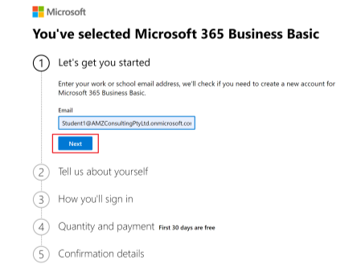

---

## Page 12

**Text:**

CHAPTER 2: GETTING STARTED WITH POWER BI 
7 | P a g e                                                      
 
 
7. Fill up the details required in the sign-up form.  
8. Keep track of the new email address and wait a few minutes for the setup to 
complete.  
You have successfully registered for an Office365 Business Basic account.

**Image 1:**

**Image 3:**
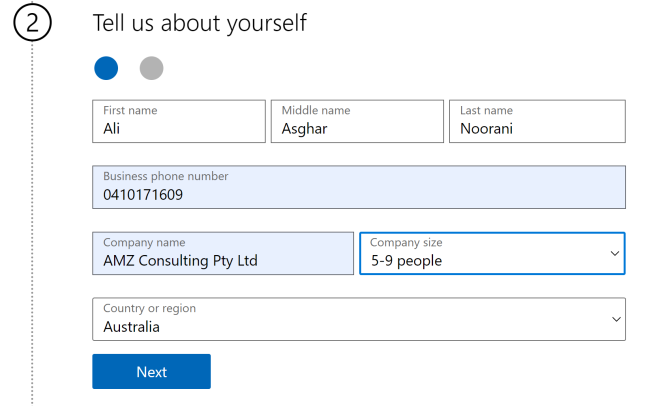

---

## Page 13

**Text:**

CHAPTER 2: GETTING STARTED WITH POWER BI 
8 | P a g e                                                      
 
Power BI Service License Comparison 
Changes in Microsoft Licenses have been coming in fast and it is advisable to subscribe 
to Power BI blogs to remain up to date with the latest announcements at: 
https://powerbi.microsoft.com/en-us/blog/ 
There are three types of Power BI licenses/subscriptions that are listed on the pricing 
page:   
Power BI Free: 
Power BI Free is included in all Office 365 Plans, and you can sign up for Power BI 
Free any time you like. With Power BI Free, some of the features that you get are as follows:  
 You can consume a data capacity of upto 1 GB/user. 
 With this license, you can import data from 70+ data sets.  
 It also allows the users to have free access to Power BI Desktop and Power BI Online.   
Power BI Pro: 
Power BI Pro costs $9.99/user/month ($13.36 AUD). It is also included in Office 365 
Enterprise E5. With Power BI Pro, some of the features that you get are as follows:  
 Everything you get with Power BI Free License +  
 You can consume a data capacity of upto 10 GB/user. 
 With this license, you can import data from 70+ data sets and you can also share reports 
with other users.  
 Consumers of the report also require a Pro license. 
Power BI Premium: 
Power BI Premium is an subscription and not a user license and this upgrade is rather 
expensive ($5000-$20000/month), so only the larger companies will get use out of it. With 
Power BI Premium, you get the following:  
 You can work with datasets up to 50 GB in size. 
 Your company gets its own dedicated capacity of 100 TB. So, you’re not relying on 
Microsoft’s shared capacity hence your operations can’t be slowed down. 
 It also allows users with free licenses to consume shared reports and dashboards with a 
Premium Capacity Workspace.

**Image 1:**

---

## Page 14

**Text:**

CHAPTER 2: GETTING STARTED WITH POWER BI 
9 | P a g e                                                      
 
Downloading Power BI Desktop 
The online version of Power BI, known as Power BI Service, has certain data modeling 
and visualization limitations. Power BI Desktop includes additional data visualization 
capabilities and enables you to build data models that you can import into Power BI Service. 
To download Power BI desktop: 
1. On the browser, go to www.powerbi.com 
2. Scroll down to the end of the page.  
3. Click on Power BI Desktop.  
 
4. Click Download Free.  
 
A pop-up appears as Power BI is available at the Microsoft Store for Windows users. 
5. Click Open Microsoft Store. 
 
6. Run the setup file to install Power BI Desktop.

**Image 1:**

**Image 3:**
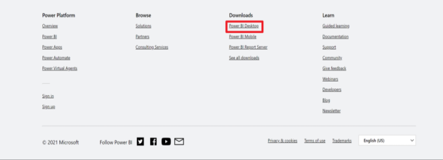

**Image 4:**

**Image 5:**
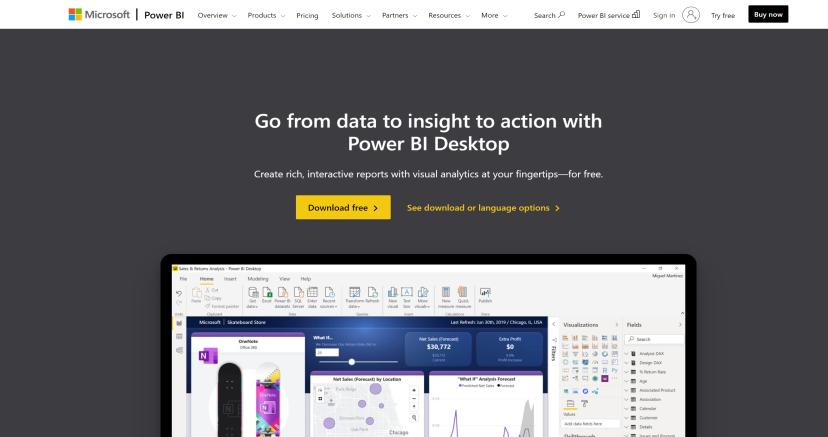

**Image 7:**
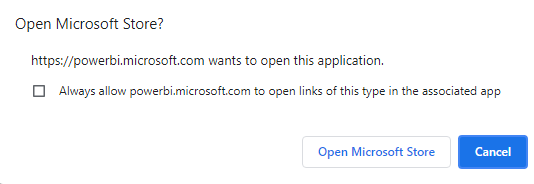

---

## Page 15

**Text:**

CHAPTER 2: GETTING STARTED WITH POWER BI 
10 | P a g e                                                      
 
7. Select Finish to run it. 
 
8. On the startup screen, select Sign In and enter your Office365 Business Basic 
email address and password. 
9. You can now use Power BI Desktop and access the complete array of features.

**Image 1:**

**Image 2:**
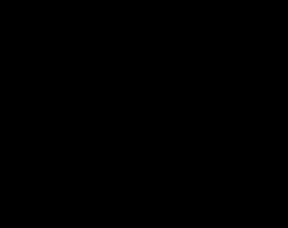

**Image 3:**

---

## Page 16

**Text:**

CHAPTER 3: POWER BI DESKTOP NAVIGATION 
11 | P a g e                                                      
 
 
 
 
Power BI Desktop Navigation 
 
 
 
 
 
 
 
 
 
 
 
 
 
 
 
 
Chapter 3 
✓ Exploring Power BI Desktop Navigation 
✓ Getting Familiar with Ribbon Menu 
➢ File 
➢ Home 
➢ Insert 
➢ Modeling 
➢ View 
➢ Help 
✓ Getting Familiar with Tab Menu 
➢ Report 
➢ Data 
➢ Relationships 
✓ Introduction to Fields, Visualization and Filters Pane 
➢ Fields Pane 
➢ Visualizations Pane 
➢ Filters Pane 
✓ Getting started with Power Query Editor 
➢ Ribbon Menu  
➢ Queries Pane 
➢ Query Settings 
➢ Data View

**Image 1:**

---

## Page 17

**Text:**

CHAPTER 3: POWER BI DESKTOP NAVIGATION 
12 | P a g e                                                      
 
Exploring Power BI Desktop Navigation 
Power BI Desktop is a free desktop application, which lets you import data from 
different sources, transform it and then convert it to visually compelling reports and 
dashboards. It also lets you share your reports on the web via Power BI Service.  In this section, 
we will introduce you to different menus and sections of Power BI Desktop.  
Power BI Desktop has four different sections for navigation purposes: 
 
1. Ribbon Menu 
2. Tab Menu 
3. Visualizations and Fields Pane 
4. Power Query Editor 
We will discuss these in detail one by one in the next section.

**Image 1:**

**Image 2:**
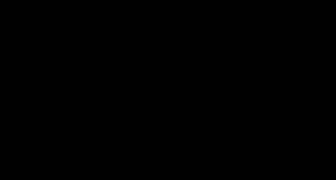

**Image 3:**

---

## Page 18

**Text:**

CHAPTER 3: POWER BI DESKTOP NAVIGATION 
13 | P a g e                                                      
 
Getting Familiar with Ribbon Menu 
Power BI Desktop's Ribbon menu, like those of other Microsoft products, includes a 
variety of options to interact with the application. Let us discuss some of them briefly. 
 
File: Once you are in the report view, on the upper left corner you have the File menu 
containing various options related to the file.  
 
Home: Home tab in the ribbon menu consists of various sub-sections that provide 
options to help you with report creation and publishing. 
 
Insert: This tab of the ribbon menu contains all the options related to adding new 
components to the report.

**Image 1:**

**Image 3:**
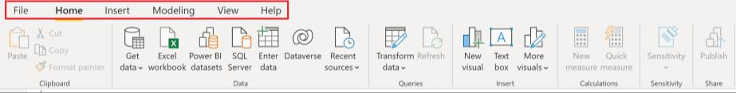

**Image 5:**
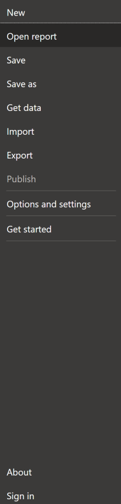

**Image 7:**
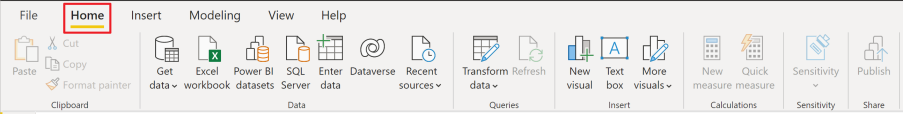

---

## Page 19

**Text:**

CHAPTER 3: POWER BI DESKTOP NAVIGATION 
14 | P a g e                                                      
 
 
Modeling: – This tab of the ribbon menu contains all options related to data modeling. 
 
View: – This tab of the ribbon menu contains options related to the user interface.  
 
Help: – This tab of the ribbon menu contains multiple options to get help from.

**Image 1:**

**Image 3:**
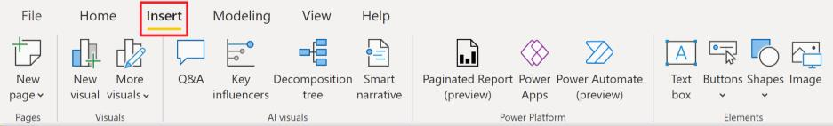

**Image 5:**

**Image 7:**

**Image 9:**
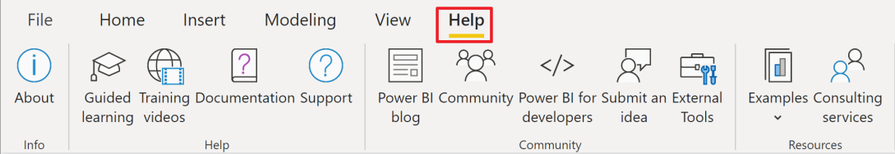

---

## Page 20

**Text:**

CHAPTER 3: POWER BI DESKTOP NAVIGATION 
15 | P a g e                                                      
 
Getting Familiar with Tab Menu 
On the left side of the application, you will see three tabs. Let us explore them from top 
to bottom. 
 
1. Report: This allows you to access the canvas where you can create your report 
using different visual techniques.  
2. Data: All your datasets are visualized in tabular format here in this section.  
3. Relationships: - You can visually see the relationship between tables here. You 
can also rearrange and connect different tables to form a data model.

**Image 1:**

**Image 3:**
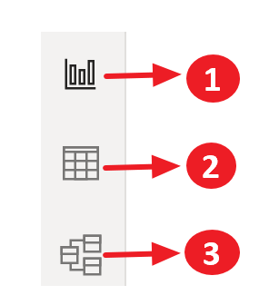

---

## Page 21

**Text:**

CHAPTER 3: POWER BI DESKTOP NAVIGATION 
16 | P a g e                                                      
 
Introduction to Visualizations and Fields Pane 
On the right side of the application, you can find the Field, Visualizations and Filters 
pane. 
 
1. Fields Pane: This pane contains all the tables in your datasets/data models and 
their respective fields/columns. 
2. Visualizations Pane: All visuals and their relevant configuration options are 
found in this tab. 
3. Filters Pane: In the Filters pane, you can configure new filters, and update 
existing filters.

**Image 1:**

**Image 2:**

**Image 3:**
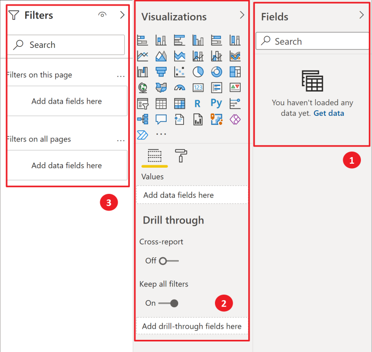

---

## Page 22

**Text:**

CHAPTER 3: POWER BI DESKTOP NAVIGATION 
17 | P a g e                                                      
 
Getting started with Power Query Editor 
Power Query Editor lets you clean and transform data for further analysis. It has 
multiple options to assist you in pre-processing of your datasets and make them usable for 
visualizations. It lets you record every step that you take to transform or clean data so that it 
can be reviewed, amended, or removed later if required. 
To open the Query Editor: 
1. Click on the Home tab in the Ribbon Menu.  
2. In the Queries section, click on Transform Data.  
3. Now click on Transform Data to enter the Query Editor.  
 
Getting Familiar with Power Query Editor 
Let us explore the navigation options briefly. 
 
1. Ribbon Menu: The Ribbon menu contains tabs with various options to help you 
in data cleaning and transformation.  
2. Queries Pane: This pane contains all the tables. 
3. Query Settings: All the steps performed on the data are recorded here during data 
cleaning and transformation. 
4. Data View: This area shows a tabular view of your data.

**Image 1:**

**Image 3:**
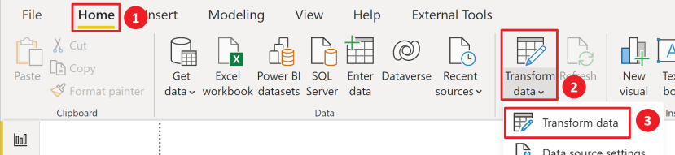

**Image 4:**

**Image 5:**
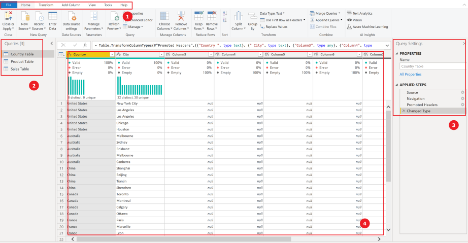

---

## Page 23

**Text:**

CHAPTER 4: GETTING DATA FROM DATA SOURCES  
18 | P a g e                                                      
 
 
 
 
Getting Data from Data Sources 
 
 
 
 
 
 
 
 
 
 
 
 
 
 
 
Chapter 4 
✓ Getting Data in Power BI 
➢ File 
➢ Database 
➢ Power BI Platform 
➢ Azure 
➢ Online Services 
➢ Other 
✓ Getting Data from Excel

**Image 1:**

---

## Page 24

**Text:**

CHAPTER 4: GETTING DATA FROM DATA SOURCES  
19 | P a g e                                                      
 
Getting Data in Power BI 
Power BI supports connection to an ample number of data sources like File, Azure 
Cloud Services, SQL Databases, websites, and even from web applications like Salesforce and 
Google Analytics, etc. You can connect to these sources by clicking on the Get Data button in 
the Home ribbon.  Some common data source categories are:  
File: 
File category contains different file types to choose from, 
including Excel, CSV, XML, PDF, Jason, etc.  You can even connect 
to a folder containing multiple flat files. 
Database: 
Database category contains industry big names like Oracle, SAP 
Hana, Amazon Redshift, SQL, and IBM etc. 
Power BI Platform:  
This lets you connect with Power Platform sources.  
Azure: 
Microsoft has its own Cloud Service called Azure. This 
category contains a long list of Azure-based databases to connect to. 
Online Services: 
Online services section provides connectivity with SaaS tools such as Google & Adobe 
Analytics, Salesforce, Dynamics, Facebook, and GitHub to name a few. 
Other: 
You can also connect to other data sources like Web, R scripts, Hadoop files, ODBC, 
Active Directory and Microsoft Exchange here.

**Image 1:**

**Image 2:**

**Image 3:**
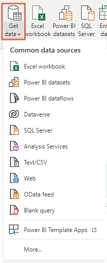

---

## Page 25

**Text:**

CHAPTER 4: GETTING DATA FROM DATA SOURCES  
20 | P a g e                                                      
 
Getting Data from Excel 
Excel is still by far the most widely used spreadsheet app by many businesses around 
the world. For this manual, download the Sales Data workbook from:    
https://www.powerbitraining.com.au/powerbidesktopcrashcoursedownloads/ 
You can get the data from Microsoft Excel into Power BI by following the below-
mentioned steps. 
1. Click on Excel Workbook in the Data section of the Home tab in the Ribbon. 
 
2. Browse to the location you saved the dataset on your computer to open it.  
 
3. Click Transform Data. 
Wait for the processing to finish and the Navigator windows to appear. 
 
 
 
 
Sometimes you need to change the path of your source file. You just need to hit on Home Tab 
>Transform data>Data Source Settings. Here you can browse your desired file path. This 
will update the source and refreshing your report will shw the impact as well.

**Image 1:**

**Image 3:**
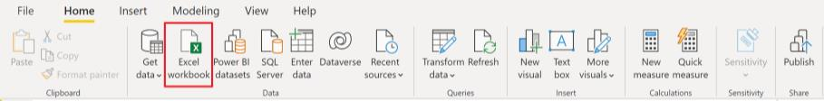

**Image 4:**
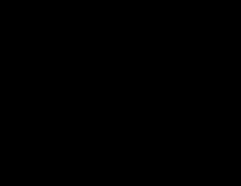

**Image 5:**

---

## Page 26

**Text:**

CHAPTER 5: DATA TRANSFORMATION   
21 | P a g e                                                      
 
 
 
 
Data Transformation 
 
 
 
 
 
 
 
 
 
 
 
 
 
 
 
 
 
 
 
 
 
 
 
Chapter 5 
✓ Removing Blank Rows from the Top 
✓ Using the First Row as a Header 
✓ Removing Blank Columns and Choosing Relevant 
Columns 
✓ Renaming Column Names 
✓ Understanding the Data Types 
➢ Number Data Types 
▪ 
Decimal Number 
▪ 
Fixed Decimal Number  
▪ 
Whole number  
➢ Date/ Time Data Types 
▪ 
Date/Time  
▪ 
Date  
▪ 
Time  
➢ Text Data Type 
▪ 
Text  
▪ 
Boolean 
✓ Removing Errors 
✓ Removing Duplicates

**Image 1:**

---

## Page 27

**Text:**

CHAPTER 5: DATA TRANSFORMATION   
22 | P a g e                                                      
 
Removing Blank Rows from the Top 
As you can see there are some blank rows on the top. We will start by removing them. 
To Remove Top Rows: 
1. Click on Sales Table Query on the left pane. 
 
The top 2 rows are empty and need to be removed. 
4. Select Remove Rows on the Home tab. 
5. Click on Remove Top Rows from the dropdown list. 
 
6. Type the number of rows, which in this case is 2. 
 
7. Click OK.

**Image 1:**

**Image 3:**
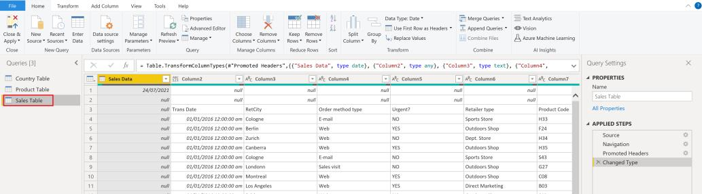

**Image 5:**
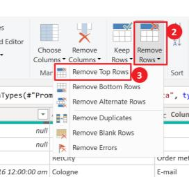

**Image 7:**

**Image 9:**
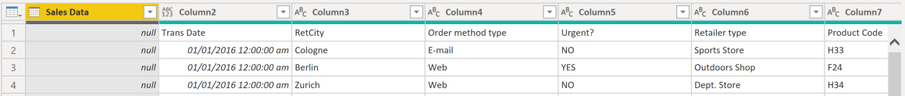

---

## Page 28

**Text:**

CHAPTER 5: DATA TRANSFORMATION   
23 | P a g e                                                      
 
Using the First Row as a Header 
After removing the top 2 empty rows, we can see that Header still contains Column 1, 
Column 2, etc. However, our actual headings (Trans Date, Ret City, etc.) are still in Row 1. 
To promote the first row to column header names: 
1. Click on Sales Table Query on the left pane. 
2. Select Use First Row as Headers. 
3. Click on Use First Row as Headers from the drop-down.  
 
The column names in the first row will be promoted to column header names.

**Image 1:**

**Image 3:**
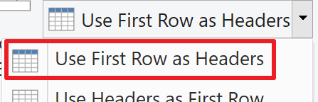

**Image 5:**
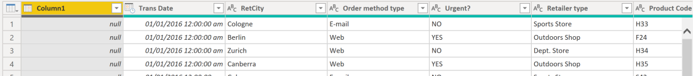

---

## Page 29

**Text:**

CHAPTER 5: DATA TRANSFORMATION   
24 | P a g e                                                      
 
Removing Blank Columns and Choosing Relevant Columns 
 Now we will remove blank and irrelevant columns. 
1. Click on Sales Table Query on the left pane. 
2. Right Click on the Column1 header to select the blank column. 
3. Click on Remove. 
 
Columns can also be removed by clicking on Remove Columns > Remove columns.  
 
In addition, we don’t need columns Order Method Type and Urgent for our analysis 
so we will remove them too. Another handy way to remove irrelevant columns (especially 
when dealing with large queries) is the Choose Column option. 
4. Select Choose Columns > Choose Columns from the Home tab. 
 
5. Uncheck Order method type and Urgent columns. 
 
 
6. Click OK.

**Image 1:**

**Image 3:**
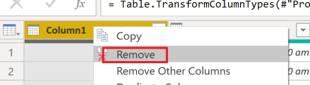

**Image 5:**
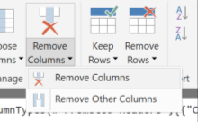

**Image 7:**

**Image 8:**
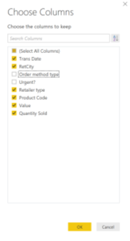

---

## Page 30

**Text:**

CHAPTER 5: DATA TRANSFORMATION   
25 | P a g e                                                      
 
Renaming Column Names 
Now, we will rename columns. The intention is to make column names as easy as 
possible. You can rename a column in two ways: 
 Right click on a column header and select rename. 
 Double click on the column header and write a new name. 
To Rename a column: 
6. Click on Sales Table Query on the left pane.  
7. Click on Trans Date and rename it to Transaction Date. 
8. Click on Value column to rename it to Sale Price. 
9. Click on RetCity and rename it to Retailer City.

**Image 1:**

**Image 4:**
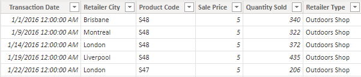

---

## Page 31

**Text:**

CHAPTER 5: DATA TRANSFORMATION   
26 | P a g e                                                      
 
Understanding the Data Types 
Although Power BI can detect correct data types automatically, but at times, we may 
need to change them. Some Important Data Types are explained below: 
Number Data Types: 
 Decimal Number: This data type can store numbers with a decimal separator and the 
numbers can be up to 15 digits long. The decimal can be placed anywhere between 
numbers. 
 Fixed Decimal Number: It has a fixed location of decimal occurrence, as it can only have 
a maximum of four digits to the right. The maximum length of this type of number is 19 
digits. This type is ideally used for currency representation. 
 Whole number: These numbers are a maximum of 19-digit long numbers with no decimal 
separator. It can be represented as both positive and negative. 
Date/ Time Data Types: 
 Date/Time: Both date and time values can be stored under this data type. Dates from 1900 
to 9999 are supported. 
 Date: Only date is supported with no time. It is suitable for scenarios where Time has no 
significance in the calculations. 
 Time: Only time is supported with no date. It is suitable for scenarios where the Date has 
no significance in the calculations. 
Text Data Type: 
 Text: This data type is a Unicode character data string and can store anything from string, 
numbers, or dates in a text format. The maximum allowed length is 268,435,456 Unicode 
characters. Data stored under this data type will have no impact on numerical calculations. 
Boolean: 
  True/False: This data type sets a value to either True or False only.

**Image 1:**

---

## Page 32

**Text:**

CHAPTER 5: DATA TRANSFORMATION   
27 | P a g e                                                      
 
Removing Errors 
Getting rid of erroneous values is also involved in the Data Transformation process. As 
you can see, we have some errors in Quantity Sold Column. 
To remove errors: 
1. Click on Sales Table Query on the left pane. 
2. Right-click on the Quantity Sold column header. 
3. Click on Remove Errors from the dropdown list.

**Image 1:**

**Image 3:**
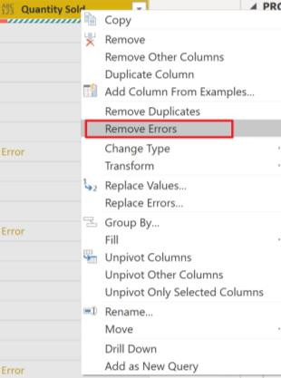

---

## Page 33

**Text:**

CHAPTER 5: DATA TRANSFORMATION   
28 | P a g e                                                      
 
Removing Duplicates 
Duplicates are one of the common problems in datasets. So far we have been working 
with Sales Table. In this exercise, we will be working with Country Table. As you can see 
Los Angeles in United States and Melbourne in Australia are duplicates. 
 
You can cope up with this issue by following below mentioned steps. 
1. Click on the Country column header, hold the Shift key and click on the City 
column header to select both. 
2. Right-click on the City column header. 
3. Click on Remove Duplicates. 
 
4. Now click on “Close & Apply” at the top left corner.  
 
 
To learn more about Data Transformation: 
https://www.powerbitraining.com.au/category/data-transformation/

**Image 1:**

**Image 3:**
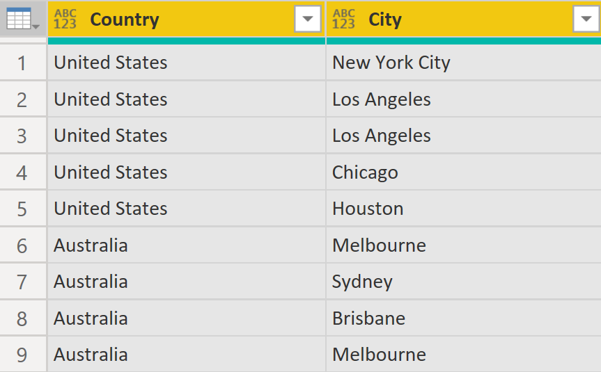

**Image 5:**
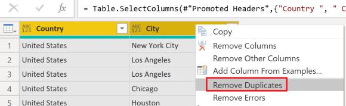

**Image 7:**
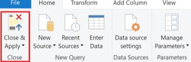

---

## Page 34

**Text:**

CHAPTER 6: INTRODUCTION TO DATA MODELING 
29 | P a g e                                                      
 
 
 
 
Introduction to Data Modeling 
 
 
 
 
 
 
 
 
 
 
 
 
 
 
 
Chapter 6 
✓ Understanding Data Modeling 
➢ Primary Keys (or a Unique Identifier) 
➢ Foreign Keys 
✓ Cardinality and Cross Filter Direction 
➢ Cardinality 
▪ Many to One (*:1)  
▪ One to One (1:1)  
▪ One to Many (1:*)  
▪ Many to Many (*:*) 
➢ Cross Filter Direction 
▪ Single  
▪ Both  
✓ Deleting Relationships 
✓ Creating New Relationships: Drag and Drop

**Image 1:**

---

## Page 35

**Text:**

CHAPTER 6: INTRODUCTION TO DATA MODELING 
30 | P a g e                                                      
 
Understanding Data Modeling 
Data Modeling is the process of creating relationships between multiple datasets. These 
Relationships are established by relating the Primary Key and Foreign Key. Once 
relationships are in place, these datasets act as a single data model which can be used for the 
purpose of visualization and reporting.  
Primary Keys (or a Unique Identifier) 
The Primary Key is the field that uniquely identifies each row in the table. In our case, 
Product Code in the Product Table will act as a Primary Key. 
Foreign Keys 
A Foreign Key is the field that refers to the Primary Key in another table. Foreign 
keys can have duplicates. In our case, Product Code in the Sales Table will act as a Foreign 
Key for the Product Code in the Product Table. 
 
Tables having Primary keys are referred to as Dimension Tables or Lookup Tables. 
Tables having foreign keys are referred to as Fact Tables or Data Tables. Usually, in a data 
model, there is a single Fact Table surrounded by multiple Dimension Tables.

**Image 1:**

**Image 2:**
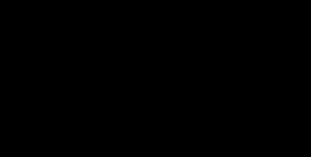

**Image 3:**

---

## Page 36

**Text:**

CHAPTER 6: INTRODUCTION TO DATA MODELING 
31 | P a g e                                                      
 
Cardinality and Cross Filter Direction 
There are two important aspects in establishing the relationship between two data sets. 
These are Cardinality and Cross Filter Direction. Let’s discuss them in detail. 
Cardinality 
Cardinality is the type of connection established between two tables. There are four 
types of Cardinalities in Power BI.  The relation between tables is denoted by two symbols, the 
asterisk (*) and 1, where the asterisk (*) represents many sides and 1 denotes a single side. 
1. Many to One (*:1) – This means the column in a given table can have more than 
one instance of a value, and the other related table has only one instance of a 
value. 
2. One to One (1:1) – This means one primary key from the dimension table will be 
linked to just one foreign key in the fact table. 
3. One to Many (1:*) – This means the column in one table has only one instance of 
a particular value, and the other related table can have more than one instance of a 
value. 
4. Many to Many (*:*) – A many-to-many relationship between tables removes 
requirements for unique values in tables. This setting indicates that there are 
multiple records for the single value in both tables.  
Cross Filter Direction 
The arrow in the center of the line represents the direction of filtering being applied to 
two tables and is called Cross Filter Direction. There are two types: 
1. Single – This is the default type. It means that filtering flows from the dimension 
table towards the fact table. 
2. Both –This means filtering flows from the dimension table towards the fact table 
and vice versa.  
 
 
 
 
Cardinality: The One-to-many and Many-to-one cardinality options are essentially the same 
and the most common type of cardinality.  
Cross filtering Direction: The “Both” Cross Filter Direction type is used in rather complex 
data models and should be used with caution as it may lead to unexpected results.

**Image 1:**

---

## Page 37

**Text:**

CHAPTER 6: INTRODUCTION TO DATA MODELING 
32 | P a g e                                                      
 
Deleting Relationships  
Relationships between data sets are auto-detected by Power BI based on columns/field 
names and values. However, sometimes this guesswork by Power BI can be incorrect. Let us 
discuss how you can delete and re-establish the relationship to rectify the error.  
1. Switch over to the Relationships tab from the left pane by clicking on the 
Relationships icon shown in the screenshot. 
 
2. Click on the connecting line between the two tables.  
3. Right-click using the mouse and select Delete, or press the delete key on the 
keyboard 
 
The line connecting the tables disappears.

**Image 1:**

**Image 3:**

**Image 4:**

**Image 5:**
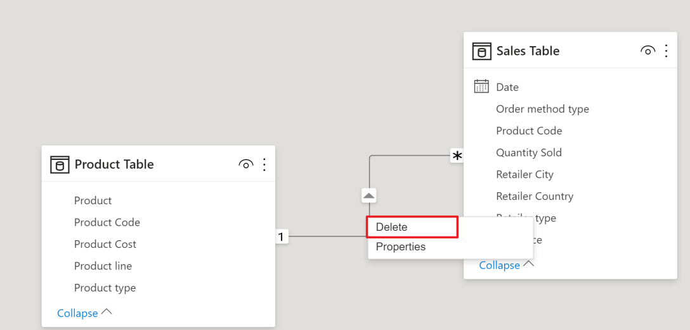

---

## Page 38

**Text:**

CHAPTER 6: INTRODUCTION TO DATA MODELING 
33 | P a g e                                                      
 
Creating New Relationships: Drag and Drop 
To create a relationship between two tables a simple drag and drop method can be used. 
We will discuss the Drag and Drop method here. 
To create relationships using this method:  
1. Click on the Product Code field in the Product Table and keep the mouse button 
clicked. 
2. Drag the mouse to the Product Code field in the Sales Table still holding the 
mouse button.  
3. Release the mouse click while on the Product Code field in the Sales Table. 
 
A relationship line will appear connecting the Product Table and the Sales Table. 
 
 
 
 
 
 
 
 
 
 
 Visit the following link to read blogs about Data Modelling: 
https://www.powerbitraining.com.au/category/data-modeling/

**Image 1:**

**Image 2:**
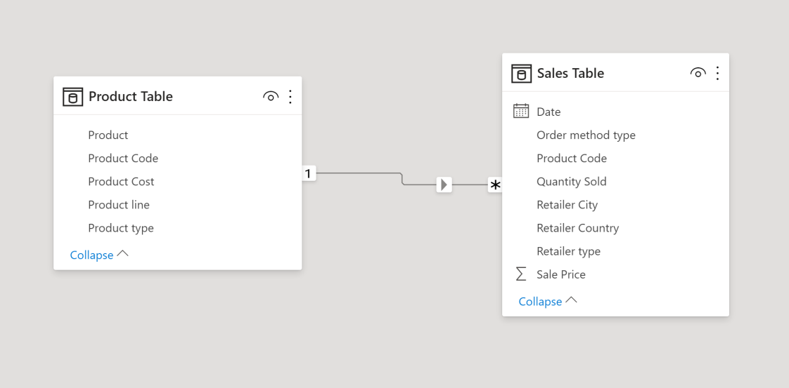

---

## Page 39

**Text:**

CHAPTER 7: INTRODUCTION TO DAX 
34 | P a g e                                                      
 
 
 
 
Introduction to DAX 
 
 
 
 
 
 
 
 
 
 
 
 
 
 
 
 
Chapter 7 
✓ What is DAX? 
✓ Defining Calculated Columns 
✓ Defining a Calculated Measure

**Image 1:**

---

## Page 40

**Text:**

CHAPTER 7: INTRODUCTION TO DAX 
35 | P a g e                                                      
 
What is DAX? 
DAX is used and applied in many Microsoft tools and platforms such as: 
 Power BI 
 Microsoft Power Pivot for Excel 
 SSAS Tabular 
DAX is a formula language which means there is one formula call with many 
parameters. This function call can also contain other function calls as parameters. All the DAX 
code is typed in the formula bar shown below. The measure/column tool additionally provides 
all the information related to the measure or column respectively.  
 
A DAX expression consists of a formula followed by a measure or a column reference.

**Image 1:**

**Image 4:**
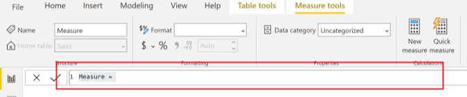

---

## Page 41

**Text:**

CHAPTER 7: INTRODUCTION TO DAX 
36 | P a g e                                                      
 
Defining Calculated Columns 
We can also calculate additional columns from existing columns so that these can then 
be used to create various visuals. This enriches your data set and enables you to perform in-
depth analysis.  
To create Calculated Columns: 
1. Right click on the Sales Table. 
2. Click on New Column.  
 
Let’s get Product Cost in the Sales Table from the Product Table. 
3. Type in the following DAX formula in Formula Bar.  
▪ Product Cost (CC) = RELATED('Product Table'[Product Cost]) 
 
Now, Let’s Create a Revenue column by multiplying Quantity Sold by Sale Price.  
4. Right click on the Sales Table. 
5. Click on New Column.  
6. Type in the following DAX formula in Formula Bar.  
▪ Revenue (CC) = 'Sales Table'[Quantity Sold]*'Sales Table'[Sale Price] 
 
Now let’s create a Total Cost column by multiplying Quantity Sold by Product Cost. 
7. Right click on the Sales Table. 
8. Click on New Column.  
9. Type in the following DAX formula in Formula Bar.  
▪ Total Cost (CC) = 'Sales Table'[Quantity Sold]*'Sales Table'[Product Cost 
(CC)]

**Image 1:**

**Image 3:**
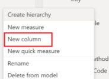

**Image 5:**

**Image 7:**

**Image 9:**

---

## Page 42

**Text:**

CHAPTER 7: INTRODUCTION TO DAX 
37 | P a g e                                                      
 
All the three columns i.e., Total Cost (CC) column, Revenue (CC) column and the 
Product Cost (CC) column have been created, giving values for which row of the table. 
 
Calculated Columns have a distinct icon, as seen in the screenshot, to differentiate 
them from other data entities. 
 
 
 
 
 
 
 
 
 
 
 
 
 
 
 
 
 
 
 
 
 
 
 
 
Notice that each of the column has been formatted using Column Tools.

**Image 1:**

**Image 3:**

**Image 5:**

---

## Page 43

**Text:**

CHAPTER 7: INTRODUCTION TO DAX 
38 | P a g e                                                      
 
Defining a Calculated Measure 
Measures are lightweight alternatives to Calculated Columns. Reason being, they do 
not appear in the data set, hence do not occupy any physical memory. Measures are only 
calculated when used within a visual and this property takes the efficiency of your data model 
to a next level. 
Let’s Calculate Profit by subtracting Product Cost from Revenue 
1. While in the Data tab on the left pane, click on the Table Tools ribbon on the top 
navigation and select Sales Table from the Fields pane on the right. 
2. Select New Measure.  
 
3. Type in below mentioned DAX formula in Formula Bar. 
▪ Profit (CM) = SUM('Sales Table'[Revenue (CC)]) - SUM('Sales Table'[Total 
Cost (CC)]) 
 
Calculated Measures have a distinct icon as seen in the screenshot to differentiate 
them from other data entities. 
 
 
 
 
 
 
 
 
To learn more about DAX, DAX Functions, and DAX Studio visit the following links: 
https://www.powerbitraining.com.au/category/dax/ 
https://www.powerbitraining.com.au/category/dax-functions/ 
https://www.powerbitraining.com.au/category/dax-studio/

**Image 1:**

**Image 3:**

**Image 5:**

**Image 7:**
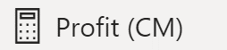

---

## Page 44

**Text:**

CHAPTER 8: DATA VISUALIZATION 
39 | P a g e                                                      
 
 
 
 
Data Visualization 
 
 
 
 
 
 
 
 
 
 
 
 
 
 
Chapter 8 
✓ Data Visualization in Power BI 
➢ Canvas 
➢ Visualization Panel 
➢ Filters Panel 
✓ Creating a Card Visual 
✓ Creating an Area Chart 
✓ Creating a Bubble Map Visual 
✓ Creating a Donut Chart 
✓ Creating a Stacked Bar Chart 
✓ Creating a Slicer

**Image 1:**

---

## Page 45

**Text:**

CHAPTER 8: DATA VISUALIZATION 
40 | P a g e                                                      
 
Data Visualization in Power BI 
 Visualizations reside in the Report section of Power BI. Report section consists of 
three main components: Canvas, Visualization Panel, and Filters Panel. Let us briefly 
discuss them one by one. 
Canvas: 
It is the blank page where data is placed in compelling visual forms. 
Visualization Panel: 
This panel consists of a set of default and custom visuals. In addition to visuals, this 
panel contains the Fields area, Formatting area, and Analytics tab. Please note, this pane is 
context-sensitive, i.e., it will change its properties based on the selected visual type. The Fields 
area contains the actual data listed as field names, which can be dragged and placed on 
Visualization pane against appropriate visuals. 
Filters Panel: 
In the Filters pane, you configure which filters to include and update existing filters.

**Image 1:**

---

## Page 46

**Text:**

CHAPTER 8: DATA VISUALIZATION 
41 | P a g e                                                      
 
Creating a Card Visual 
As we have got ourselves familiar with different panels in the report section. It is time 
to discuss some of the visual types and their usage. 
Card visuals are used /to display key metrics of your data.  
To create a Card Visual: 
1. Click on Card visualization. 
2. Drag Total Cost (CC) value from Sales Table to the Field area. 
3. Click on Total Cost (CC) in the Sales Table. 
Column tools open.  
4. Click on “$” and type 2 in the text area.  
 
5. Click on Paint Roller Icon to access Format options. 
6. Set the Category Label > Off, Border > On, Title > On, Title Text> “Total 
Cost”, Title Text Size > 15, Title Alignment > Centre, Title Background 
Color > Black and Title Font Color > White.

**Image 1:**

**Image 3:**
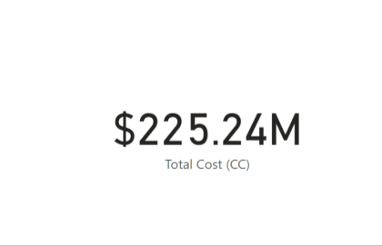

**Image 5:**
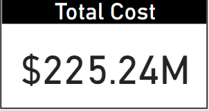

---

## Page 47

**Text:**

CHAPTER 8: DATA VISUALIZATION 
42 | P a g e                                                      
 
Creating an Area Chart  
 Area charts emphasize the magnitude of change over time, and can be used to draw 
attention to the total value across a trend. For example, data that represents profit over time can 
be plotted in an area chart to emphasize the total profit. 
To create an Area chart: 
1. Click on the Area Chart visualization. 
2. Drag Transaction Date from Sales Table to the Axis field. 
3. Drag Revenue (CC) and Profit (CM) from Sales Table to the Values field. 
4. Click on the Paint Roller icon to access the Format options. 
5. Set the Title Text > Revenue and Profit by Transaction Date, Zoom slicer > 
On.

**Image 1:**

**Image 3:**
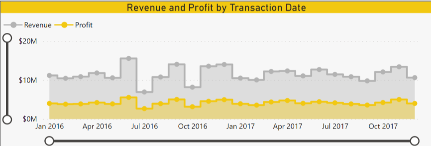

---

## Page 48

**Text:**

CHAPTER 8: DATA VISUALIZATION 
43 | P a g e                                                      
 
Creating a Bubble Map Visual 
A bubble map is used to display geographical data with different sized bubbles. The 
size of the Bubble is directly proportional to the numerical value it indicates. 
To create a Bubble Map: 
1. Click on the Map visualization. 
2. Drag Retailer City from Sales Table to the Location field. 
3. Drag Total Cost (CC) from Sales Table to the Size field. 
4. Click on Paint Roller icon to access the Format options. 
5. Set the Bubbles > Size > 15, Title > On, Title Text > Total Cost by Retailer 
City, Title Text Size > 15, Title Alignment > Centre, Title Background Color 
> #F2C811, Data Colors > #F2C811, Map Styles > Dark, Background > On, 
Background Color > #F2C811 and Border > On.

**Image 1:**

**Image 3:**
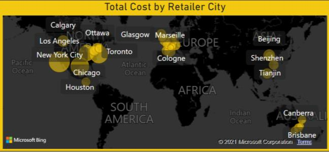

---

## Page 49

**Text:**

CHAPTER 8: DATA VISUALIZATION 
44 | P a g e                                                      
 
Creating a Donut Chart 
A donut chart is a variation of the pie chart and is generally used to show the proportions 
of categorical data, with the size of each segment representing the proportion of each category. 
To create a Donut Chart: 
1. Select Donut Chart. 
2. Drag Retailer Type from Sales Table to Legend field. 
3. Drag Total Cost (CC) from Sales Table to Value field. 
4. Click on Paint Roller Icon to access Format options. 
5. Set the Title > Cost incurred by Retailer Type.  
 
 
 
 
 
 
 
 
 
 
Hovering with the mouse over the Donut Chart will display a tooltip with more information 
including the percentage.

**Image 1:**

**Image 3:**
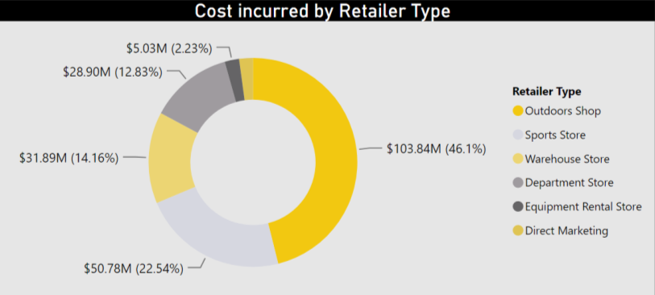

---

## Page 50

**Text:**

CHAPTER 8: DATA VISUALIZATION 
45 | P a g e                                                      
 
Creating a Stacked Bar Chart 
A stacked bar chart is used to break down and compare statistics between different 
catrgories.  
To create a Stacked Bar Chart: 
1. Select Stacked Bar Chart. 
2. Drag Product Type from Product Table to Axis field. 
3. Drag Country from Country Table to Legend field. 
4. Drag Revenue (CC) from Sales Table to Values field. 
5. Expand Country in Visual level filters. 
Top N filter is a type of visual level filter which when applied displays N number 
of top items in a visual based on the given value. 
6. Select Top N from Filter Type dropdown. 
7. Type “3” in Show Items > Top. 
8. Drag Revenue (CC) from Sales Table to By Value Field. 
9. Click on Apply Filter.  
10. Click on Paint Roller Icon to access Format options. 
11. Set the Title > Revenue for top 3 Countries by Product Type.

**Image 1:**

**Image 3:**
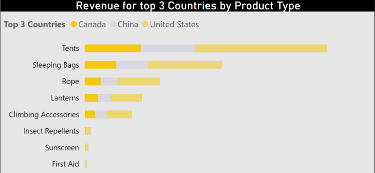

---

## Page 51

**Text:**

CHAPTER 8: DATA VISUALIZATION 
46 | P a g e                                                      
 
Creating a Slicer 
Slicer is an alternate way of filtering, that narrows the other visualizations in a report. 
Unlike filters, the slicers are present as a visual on the report.  
To create a Slicer: 
1. Click on Slicer. 
2. Drag Product Line from Product Table to the Field area. 
3. Click on Paint Roller Icon to access Format options. 
4. Set the Slicer Header > On and Slicer Title > Off. 
5. To filter the whole report for Camping Equipment, click on its checkbox.  
  
 
 
 
 
 
 
 
 
 
 
 
 
 
 
 
 
 
 
 
Filters Pane on the right side configures visual, page and report level filters.

**Image 1:**

**Image 3:**
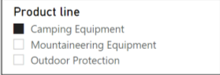

---

## Page 52

**Text:**

CHAPTER 9: PUBLISH AND SHARE 
47 | P a g e                                                      
 
 
 
 
Publish and Share 
 
 
 
 
 
 
 
 
 
 
 
 
 
 
 
 
Chapter 9 
✓ Save and Publish to My Workspace 
✓ Sharing the Report

**Image 1:**

---

## Page 53

**Text:**

CHAPTER 9: PUBLISH AND SHARE 
48 | P a g e                                                      
 
Save and Publish to My Workspace 
Now that you have created your report. It is time to publish your report to the web so 
we can create dashboards and share them with other stakeholders. 
1. Click on the File > Save. 
2. Rearrange your visuals as shown below or in any other way that you may like.  
 
3. Click on File menu again and click Publish. 
4. Click on Publish to Power BI.  
 
5. Select the appropriate Workspace and click Select.

**Image 1:**

**Image 2:**
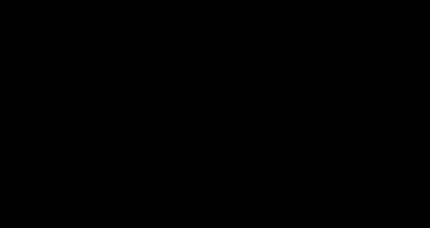

**Image 3:**

**Image 4:**
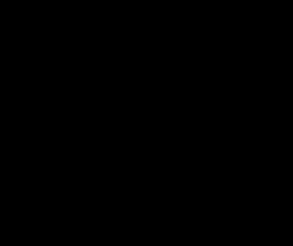

**Image 5:**

---

## Page 54

**Text:**

CHAPTER 9: PUBLISH AND SHARE 
49 | P a g e                                                      
 
 
Confirmation dialogue box will appear once your report has been published on web. 
You can now share the link to your report by visiting Power BI app on the web.  
 
 
 
 
 
 
 
 
 
 
 
 
 
 
 
 
 
 
 
 
 
To understand the visuals in more depth, download the Crash Course file from the following 
link and access the complete Power BI report:   
https://www.powerbitraining.com.au/powerbidesktopcrashcoursedownloads/

**Image 1:**

**Image 2:**
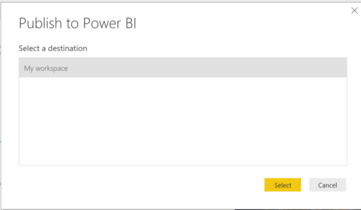

---

## Page 55

**Text:**

CHAPTER 9: PUBLISH AND SHARE 
50 | P a g e                                                      
 
Sharing the Report 
Reports published to Power BI Service can then be shared with other stakeholders via 
shareable link or as a dashboard.   
1. Open app.powerbi.com and sign in using your login credentials. 
 
2. Click on My Workspaces on the Navigation pane on the left to access your 
workspace components. 
 
In the Report tab, list of all the Published Reports can be seen. 
3. Go to Report section > Sales Report in Power BI service. 
4. Click on Share in upper right corner of the menu ribbon. 
5. In the given field enter Email address of person you want to share the Report with. 
6. You can include a message as well for the recipient.

**Image 1:**

**Image 3:**
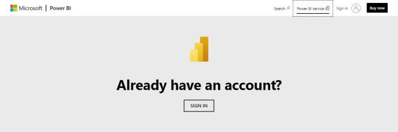

**Image 5:**
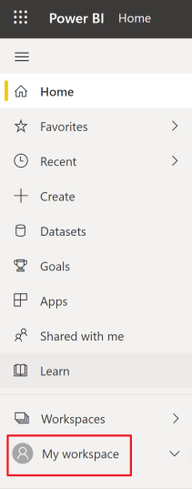

---

## Page 56

**Text:**

POWER BI QUIZ 
51 | P a g e                                                      
 
 
 
 
 
 
 
 
Take the Power BI Quiz! 
 
 
 
 
 
 
 
Take the Quiz from the following link to test your 
understanding of Power BI:  
 
https://www.powerbitraining.com.au/power-bi-
crash-course-quiz/

**Image 1:**

**Image 2:**

**Image 3:**

---

## Page 57

**Text:**

COMPANY INFORMATION 
52 | P a g e                                                      
 
 
 
 
 
 
 
 
AMZ Consulting Pty Ltd 
 
 
 
 
 
 
 
 
 
Ali Asghar 
Noorani,  
Founder, AMZ 
Consulting Pty Ltd 
https://www.linkedin.co
m/in/trainernoorani/ 
 
ABN: 
11627874668 
 
  Company’s Services (Both Online and Onsite):  
• Power BI Consulting 
• Power BI Public Training 
• Power BI Corporate Training 
  Products: 
• Power BI Basic: 
https://www.powerbitraining.com.au/power-bi-basic-
training-course/  
• Power BI Advanced: 
https://www.powerbitraining.com.au/power-bi-advanced-
training-course/  
• Power BI DAX: 
https://www.powerbitraining.com.au/dax-course/  
  Contact Details: 
• Training: info@amzconsulting.com.au  
• Consulting: projects@amzconsulting.com.au  
• Phone: 0410171609 
 
https://amzconsulting.com.au/ 
https://www.powerbitraining.com.au/

**Image 1:**

**Image 3:**

**Image 4:**

---
